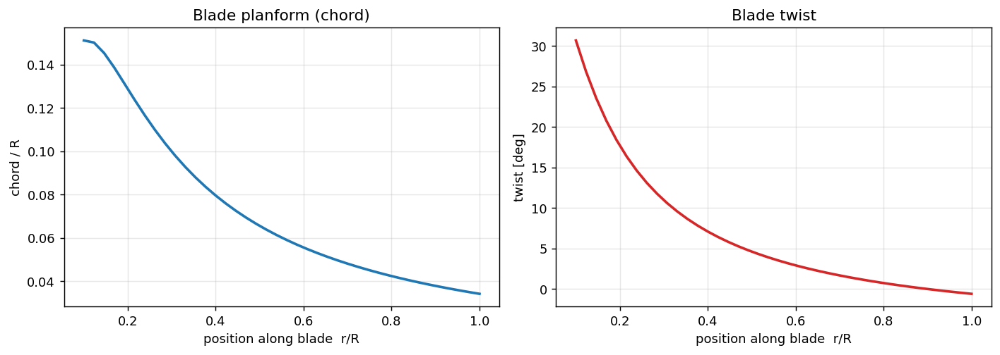
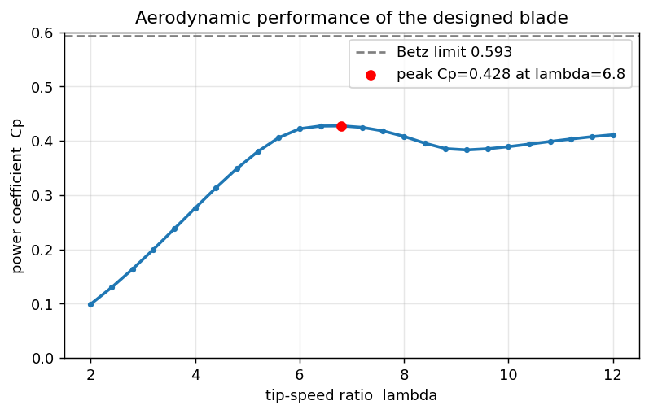
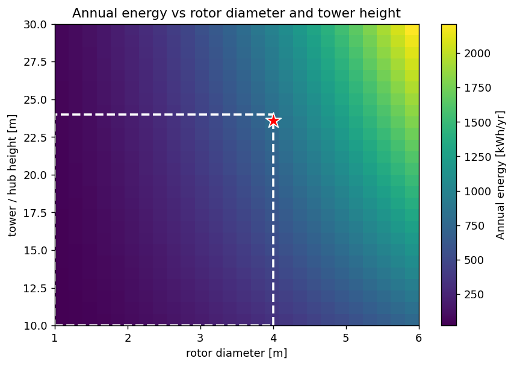
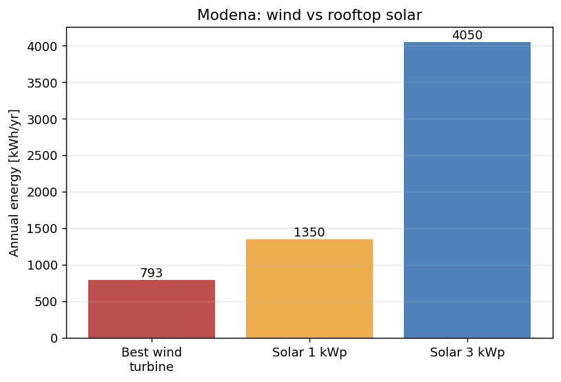

# Small Wind Turbine Feasibility Study — Modena, Italy

A physics-based, from-scratch study of whether a small wind turbine makes sense in Modena
(Po Valley). Built in Python, runs free in Google Colab — no installation.

 — wind resource & energy

 — blade design & optimisation

**Headline result:** Modena is a weak-wind site (~2 m/s at 10 m). Even an optimally sized turbine
within residential limits (4 m rotor, 24 m tower) would produce only ~**793 kWh/year** (~29% of a
typical Italian home). A modest rooftop solar array produces about **5× more** energy at the same
location — so for Modena, **solar is the right choice, not wind.** The value of the project is
reaching that conclusion with evidence.

## What's inside

The study has two notebooks:

1. **`notebooks/01_wind_resource_and_energy.ipynb`** — models the wind with a Weibull
   distribution, builds a turbine power curve, and computes Annual Energy Production, household
   offset, and CO₂ avoided.
2. **`notebooks/02_blade_design_and_optimisation.ipynb`** — designs a turbine blade from
   aerodynamic theory (optimal chord and twist), evaluates its real efficiency with a **Blade
   Element Momentum (BEM)** solver, optimises rotor diameter and tower height, and compares wind
   against rooftop solar.

## Selected figures

## How to run

1. Go to [colab.research.google.com](https://colab.research.google.com).
2. **File → Upload notebook** and choose a notebook from `notebooks/`.
3. **Runtime → Run all.** Everything executes and redraws the charts.
4. Change the values in the **INPUTS** cell to explore different sites and designs.

To run locally instead: `pip install -r requirements.txt` then open the notebooks in Jupyter.

## Method in one paragraph

Wind power scales with the cube of wind speed (P = ½ρAv³C_p), so site wind dominates. The wind
resource is described by a Weibull distribution and projected to hub height with a wind-shear power
law. The blade is designed using Betz-optimum theory and evaluated with BEM including drag and
Prandtl tip-loss corrections, giving a peak power coefficient C_p ≈ 0.43 (below the Betz limit of
0.593, as physics requires). Annual energy is obtained by integrating the power curve against the
wind distribution over 8,760 hours.

## Data sources

- Wind: [Global Wind Atlas](https://globalwindatlas.info/) (DTU / World Bank);
  [NASA POWER](https://power.larc.nasa.gov/) (NASA Langley).
- Solar (comparison): [PVGIS](https://pvgis.com/) (EU Joint Research Centre).
- Household electricity (Italy): ARERA standard ~2,700 kWh/yr. Grid carbon intensity ~0.31 kg
  CO₂/kWh (Italy, ~2024).

## Limitations

A model, not a field measurement: single Weibull resource, simplified analytic airfoil, no
turbulence/siting/cost modelling, and an assumed variable-speed (optimal tip-speed-ratio)
operation. These refine the numbers but not the central, resource-driven conclusion. See
`report/Modena_Wind_Report.md` for the full write-up.

## License

MIT — see `LICENSE`.
